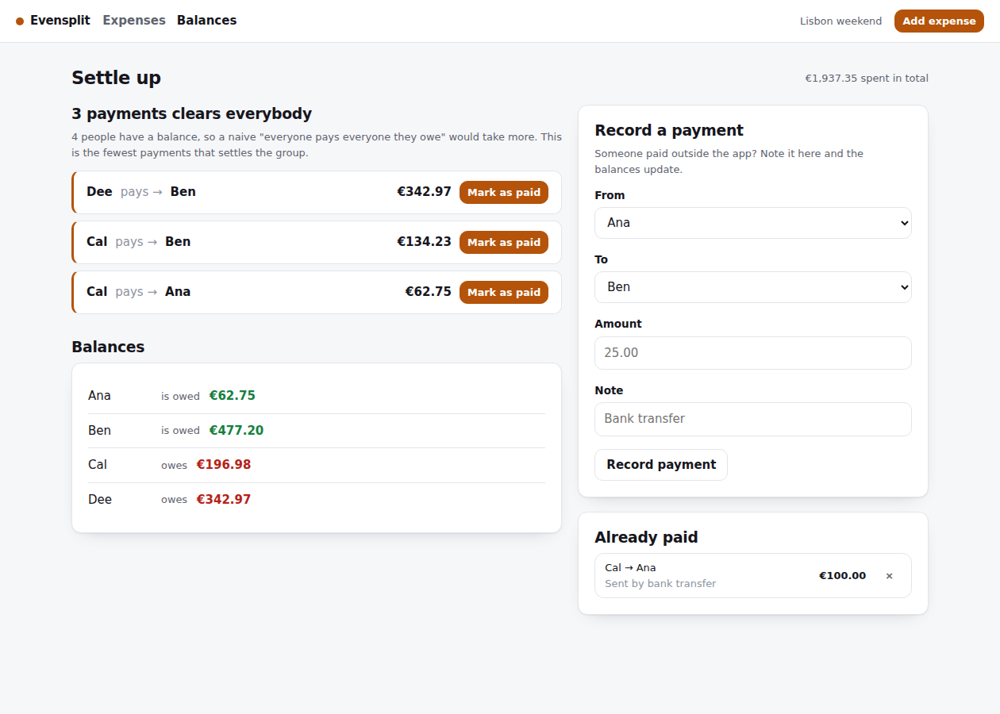

# Evensplit

Shared expenses for a group — a trip, a house, a dinner. Add who paid for what,
split it evenly or not, and get back the shortest list of payments that clears
everybody.

**[Run it in one command](#running-it)** — the demo group seeds itself with four
people, ten expenses across four split modes and a payment already made, so the
settle-up page has something real to simplify.



---

## The hard part

### 1. Money is an integer, and splitting it is not division

Every amount in this codebase is a whole number of cents. `0.1 + 0.2 !== 0.3`
is the famous reason to avoid floats for money, but the one that actually shows
up in a splitter is this:

> Three people split €100. Each owes €33.333…, and any honest representation of
> that number will lose or gain a cent when you add it back up.

There is no rounding rule that fixes it. You have to *decide* who gets the odd
cent. Evensplit uses the **largest remainder method**: everyone gets the floor
of their exact share, then the leftover cents go out one at a time, largest
fractional part first, ties broken by position so the result is deterministic:

```
€100.00 between three  →  [3334, 3333, 3333]   (sums to exactly 10000)
```

Deterministic matters more than it sounds: the same expense splits the same way
every time it is rendered, so nobody reloads the page and finds they now owe a
different cent than their friend's screen says.

The property that holds everywhere, and is tested exhaustively rather than by
example:

```ts
for (let total = 0; total <= 2000; total += 7)
  for (let people = 1; people <= 9; people++)
    assert(sum(splitEqually(total, people)) === total);
```

...plus a ledger test that runs forty deliberately awkward expenses (997 cents,
1010 cents, 1023 cents…) through overlapping subsets of five people and asserts
that the balances still sum to exactly zero afterwards. Not one cent invented,
not one lost.

Input is parsed with the same strictness. `"12.345"` is **rejected**, not
rounded — silently deciding half a cent of someone's money is how a splitter
loses trust.

### 2. The fewest payments, and why "greedy" is not the answer

Ana owes Ben €4, Ben owes Cal €4. Nobody needs to make two payments: Ana pays
Cal, and Ben never touches the money. Collapsing the whole group's debts into a
single net balance per person makes that obvious. The real question is what to
do next, and it has a precise structure:

> With **n** people holding a non-zero balance, settling takes **n − k**
> transfers, where **k** is the largest number of groups you can partition them
> into such that each group's balances sum to zero.

Each zero-sum group settles internally in (size − 1) transfers, and a payment
between two such groups can never help. So minimising transfers means
*maximising the number of zero-sum subsets* — which is the subset-sum problem,
and therefore NP-hard.

Most implementations stop at the greedy rule (largest debtor pays largest
creditor, repeat). It is O(n log n), never worse than n − 1 transfers, and
usually right. But not always:

```
Ana −6.00   Ben −6.00   Cal −4.00   Dee +10.00   Eve +6.00

greedy:  4 payments
optimal: 3 payments  (Ana↔Eve cancel exactly; greedy never notices)
```

That case is a test, not a footnote. `simplifyOptimal` finds the true minimum
with a bitmask DP over all 2ⁿ subsets — for each subset, the best partition is
built by fixing the lowest-indexed member and trying every sub-subset
containing it, which enumerates each partition exactly once. It runs for groups
up to 16 people, which is every dinner, house share and holiday; above that
`simplify` falls back to greedy, and the code says so.

The randomised test asserts three things over 400 generated groups: the plan
always settles everyone to zero, it never exceeds n − 1 transfers, and it is
**never worse than greedy**.

### A third thing: a settlement is not a special case

Paying someone back is modelled as the same kind of fact as paying for dinner:

```
balance = paid for expenses − share of expenses + payments made − payments received
```

No "debt" table, no marking things as closed, no state machine to get out of
sync. Deleting an expense or undoing a payment just changes the sum. Because
every term appears once positive and once negative across the group, the
balances provably sum to zero — and `simplify` throws if they ever do not,
because that means a bug here rather than an unusual group.

## Pages

| Route | What it is |
|---|---|
| `/` | Landing, with one-click demo group |
| `/g/:slug` | The group: expenses, who paid, where everyone stands |
| `/g/:slug/expenses/new` | Add an expense — evenly, by shares, by percent, or exact |
| `/g/:slug/balances` | Balances and the settle-up plan, with one-click "mark as paid" |

Groups are unlisted random links — no signup, no invitations.

## Stack

Node 22, TypeScript, Express, EJS, Postgres 16 (raw SQL, no ORM). The only
client-side JavaScript validates the split before you submit; the server does
the same arithmetic in integer cents and is the one that decides.

## Running it

```bash
docker compose up          # http://localhost:3000, demo group seeded
```

Or against your own Postgres:

```bash
cp .env.example .env
npm install
npm run migrate && npm run seed
npm run dev
```

## Tests

```bash
createdb evensplit_test
echo "DATABASE_URL=postgres://localhost:5432/evensplit_test" > .env.test
npm test
```

34 tests: exhaustive allocation properties, the greedy-vs-optimal counterexample,
randomised settlement plans, and a ledger test that puts forty awkward expenses
through Postgres and checks the books still balance.

## Deploying

One click on Render — there is a `render.yaml` that creates the database and
the web service together. Railway and Fly.io instructions are in
[DEPLOY.md](DEPLOY.md).

The app boots with nothing but `DATABASE_URL`: migrations run on startup and
the demo data seeds itself, so a fresh deploy has something to look at
straight away.

Migrations run on boot.

## Shortcuts taken

- **Anyone with the link can edit**, including deleting expenses. Fine for
  friends, not for strangers.
- **One currency per group**, with no conversion. Multi-currency needs
  per-expense rates and a decision about who absorbs the drift.
- **No edit-an-expense** — delete and re-add.
- **No audit trail.** A deleted expense is gone, which is the wrong call for
  anything involving money over a longer period than a holiday.
- **Single payer per expense.** The schema would take multiple payers with one
  more table; the form would take considerably more thought.

## Licence

MIT
